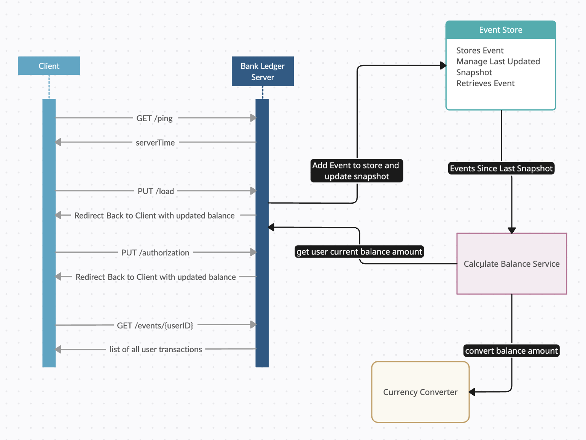

## Bootstrap instructions

### Getting Started

Follow the instructions below to set up the project locally on your machine.

### Prerequisites

Ensure you have the following installed:

- **Java Development Kit (JDK) 21**
```bash
brew install openjdk
```
- **Apache Maven**
```bash
brew install maven
```
Verify by 
```bash
java --version
mvn --version
```
### Step 1: Clone the Repository

Start by cloning the repository from GitHub:

```bash
git clone https://github.com/codescreen/CodeScreen_yutm3kcx.git
cd CodeScreen_yutm3kcx
```
### Step 3: Build the Project
Use the following command to build the project:

```bash
mvn clean install
```
### Step 4: Run the Project
```bash
mvn spring-boot:run
```
### Step 5: Use Default or Setup your own Exchange Rate API
This project uses the Exchange Rate API for currency conversion. A default key has been provided for assessment purposes. To replace it with your own API key:

Go to ExchangeRate-API.
Sign up with your email to get a free API key.
Update the api.exchangeRate.key property in src/main/resources/application.properties with your new key:
```bash
api.exchangeRate.key=YOUR_API_KEY
```
### Step 6: Test the Server
Port is set to 9090 for this in application.properties
```bash
server.port=9090
```
To confirm the server is running, open a browser and navigate to:
```bash
http://localhost:9090/ping
```
You should receive a response of server date and time

## Design considerations

In building the Bank Ledger System, As outlined by the task I decided to use the **event sourcing pattern**. It provides audability, scalability, consistency, flexibility and resilience. Along with that I followed some standard practices and design layout to implement the project which is discussed below.

### Controller Design

The `TransactionController` class handles the core functionality of the application. It manages incoming requests for loading funds and authorizing transactions. The controller validates inputs and interacts with the `EventStore` to manage events.

#### Error Handling

The controller includes error handling for invalid inputs and unexpected issues. By returning structured error responses, the controller maintains clarity and consistency in error reporting.

### DTO Design

The **Data Transfer Objects (DTOs)** are used to encapsulate data and transfer it between different layers of the application. The DTOs in this project, such as `LoadRequest`, `AuthorizationRequest`, and `AuthorizationResponse`, are designed to structure incoming and outgoing data, ensuring type safety and clarity in the communication between the client and server.

### Enum Design

The **enums**, such as `DebitCredit` and `ResponseCode`, define the possible types of transactions and response codes. Using enums ensures that the application operates on a predefined set of constants, improving code readability and reducing errors from invalid values.

### Event Store Design with Snapshot Thread Safety

The `EventStore` class manages the storage and retrieval of events. It uses concurrent data structures to handle multiple users and ensures thread safety when updating snapshots.

#### Snapshot Management

To optimize performance, the event store maintains snapshots of account balances. This allows for efficient balance calculations by only considering events since the last snapshot.

### Currency Conversion

The `CurrencyConverter` class manages currency conversions. The system uses a third-party API for exchange rates, with a fallback mechanism for default rates.

### Extra Endpoint: List User Transactions
An additional endpoint, /events/{userId}, was implemented to retrieve all transactions for a specific user ID. This endpoint allows the user to view the comprehensive auditing of user transactions and also support in testing and validating serializability.

### Architecture Diagram

The diagram below illustrates the high-level architecture of the Bank Ledger System:




## Assumptions
1. **Default Base Currency**:
One key design assumption in the Bank Ledger System revolves around the handling of currencies. Given the lack of explicit requirements for a specific base currency, it was assumed that transactions could involve multiple currencies and that the system should accommodate this variability.
Following the event sourcing pattern, each event (such as a load or authorization) is recorded in the original currency in which it was conducted. This approach ensures auditability and traceability by preserving the original transactional data. However, to facilitate balance calculations, snapshots are maintained in the base currency of USD.
During balance calculation, all relevant transaction amounts are first converted to USD using the CurrencyConverter class. The calculated balance is then returned in the currency specified in the original request, whether it’s a load or authorization. This ensures that the balance aligns with the user's preferred currency while maintaining a consistent internal representation for calculations.

2. **Currency Conversion Availability**:  
The system assumes that the currency conversion API is available and provides accurate rates The CurrencyConverter relies on this API for conversions, and fallback mechanisms is that if there is API failure, the rate of conversion will be 1 and the amount will be returned in original value. In future implementation a separate Cache could be maintained to handle this.

3. **Invalid Transaction Handling**:
The system assumes that invalid transactions, such as negative amounts or incorrect transaction types, should be rejected outright. The TransactionController validates incoming requests to ensure that transactions are of the correct type (CREDIT for loads and DEBIT for authorizations).

4. **Timestamp-Based Snapshot**: 
The system assumes that snapshots should be updated based on the most recent event timestamp. This allows the system to track account balances at specific points in time, facilitating detailed auditing and historical balance reconstruction.

5. **Non persistent store**:
Currently the System doesnt use a persistent memory store. This simplifies implementation but acknowledges that a persistent store would be necessary for larger-scale applications or when data durability is required.

## Bonus: Deployment considerations

To deploy the service, we would create docker image and then deploy it to AWS EC2

#### Step 1: Dockerize the Application

1. **Create a Dockerfile**  
   - Add a `Dockerfile` to your project's root directory with the following content:
     ```dockerfile
     # Use an official OpenJDK runtime as a parent image
     FROM openjdk:17-jdk-slim

     # Set the working directory in the container
     WORKDIR /app

     # Copy the project jar file into the container at /app
     COPY target/bank-ledger-system.jar /app/bank-ledger-system.jar

     # Make port 9090 available to the world outside this container
     EXPOSE 9090

     # Run the jar file
     ENTRYPOINT ["java", "-jar", "bank-ledger-system.jar"]
     ```

2. **Build the Docker Image**  
   - Open a terminal and navigate to your project's root directory.
   - Run the following command to build the Docker image:
     ```bash
     mvn clean install
     docker build -t bank-ledger-system:latest .
     ```

3. **Run the Docker Container**  
   - Run the following command to start the container:
     ```bash
     docker run -p 9090:9090 bank-ledger-system:latest
     ```

#### Step 2: Deploy to AWS

##### Deploy to AWS ECS (Elastic Container Service)

1. **Push the Docker Image to Amazon ECR**

   - Create an ECR repository to store the Docker image:
     ```bash
     aws ecr create-repository --repository-name bank-ledger-system --region us-west-2
     ```
   
   - Tag the Docker image:
     ```bash
     docker tag bank-ledger-system:latest <aws_account_id>.dkr.ecr.us-west-2.amazonaws.com/bank-ledger-system:latest
     ```

   - Push the Docker image to ECR:
     ```bash
     $(aws ecr get-login --no-include-email --region us-west-2)
     docker push <aws_account_id>.dkr.ecr.us-west-2.amazonaws.com/bank-ledger-system:latest
     ```

2. **Create a Task Definition for ECS**

   - Create a task definition JSON file (`ecs-task-def.json`) with the following content:
     ```json
     {
       "family": "bank-ledger-system",
       "networkMode": "awsvpc",
       "containerDefinitions": [
         {
           "name": "bank-ledger-system",
           "image": "<aws_account_id>.dkr.ecr.us-west-2.amazonaws.com/bank-ledger-system:latest",
           "portMappings": [
             {
               "containerPort": 9090,
               "hostPort": 9090
             }
           ],
           "essential": true
         }
       ],
       "requiresCompatibilities": ["FARGATE"],
       "cpu": "256",
       "memory": "512"
     }
     ```

   - Register the task definition:
     ```bash
     aws ecs register-task-definition --cli-input-json file://ecs-task-def.json
     ```

3. **Create an ECS Cluster and Service**

   - Create a new ECS cluster:
     ```bash
     aws ecs create-cluster --cluster-name bank-ledger-cluster
     ```

   - Create an ECS service:
     ```bash
     aws ecs create-service \
       --cluster bank-ledger-cluster \
       --service-name bank-ledger-service \
       --task-definition bank-ledger-system \
       --desired-count 1 \
       --launch-type FARGATE \
       --network-configuration "awsvpcConfiguration={subnets=[<subnet-id>],securityGroups=[<security-group-id>],assignPublicIp=ENABLED}"
     ```

   - Replace `<subnet-id>` and `<security-group-id>` with the appropriate IDs for your VPC.

#### Step 3: Accesing the Endpoint

1. **Create an Application Load Balancer (ALB)**  
   - In the **EC2 Dashboard**, navigate to **Load Balancers** and click **Create Load Balancer**.
   - Select **Application Load Balancer** and configure:
     - **Name**: e.g., `bank-ledger-alb`
     - **Scheme**: `internet-facing`
     - **Listeners**: HTTP on port `80`
     - **Availability Zones**: Select the VPC and zones for your ECS service.
   - Set up a target group:
     - **Name**: e.g., `bank-ledger-target-group`
     - **Port**: `9090`
     - **Health Check Path**: `/ping`
   - Register targets and create the ALB.

2. **Update the ECS Service**  
   - In the **ECS Dashboard**, select your cluster (`bank-ledger-cluster`) and service (`bank-ledger-service`).
   - Go to **Update** and attach the previously created target group (`bank-ledger-target-group`).
   - Update the service.

3. **Access the Application**  
   - In the **EC2 Dashboard**, go to **Load Balancers**.
   - Copy the **DNS Name** of your ALB (e.g., `bank-ledger-alb-123456789.us-west-2.elb.amazonaws.com`).
   - Access the application at `http://<alb-dns-name>/ping` (e.g., `http://bank-ledger-alb-123456789.us-west-2.elb.amazonaws.com/ping`).


## License

At CodeScreen, we strongly value the integrity and privacy of our assessments. As a result, this repository is under exclusive copyright, which means you **do not** have permission to share your solution to this test publicly (i.e., inside a public GitHub/GitLab repo, on Reddit, etc.). <br>

## Submitting your solution

Please push your changes to the `main branch` of this repository. You can push one or more commits. <br>

Once you are finished with the task, please click the `Submit Solution` link on <a href="https://app.codescreen.com/candidate/39d70d57-d748-4835-b66c-6fcf0ac818e1" target="_blank">this screen</a>.
